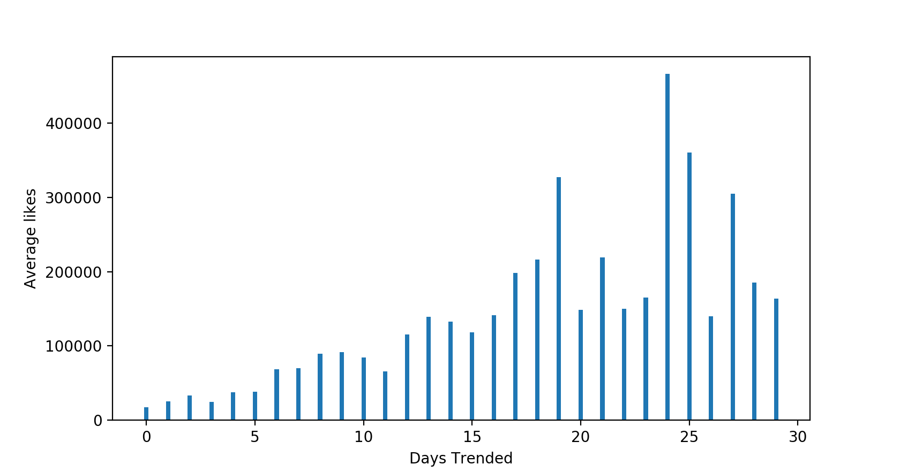

## Pandas-EDA-Case-Study

# The goal of this project was to explore the dataset

# Describing the data

### We had data from 10 regions including USA, Great Britain, Germany, Canada, France, Russia, Mexico, South Korea, Japan, and India. Most of the following analyses were conducted on an overall dataset representing the combination of all included regions. Individual datasets were used for analyses on specific regions.

## Features included in dataset:

Feature Name | Feature Type
------------ | -------------
video_id | Text
trending_date | Text
title | Text
channel_title | Text
category_id | Categorical
publish_time | Text
tags | Text
views | Numerical
likes | Numerical
dislikes | Numerical
comment_count | Numerical
thumbnail_link | Text
comments_distabled | Boolean
ratings_disabled | Boolean
video_error_or_removed | Boolean
description | Text

# Missing data:

#### Description was missing 19478 values. No actions to resolve missing values were taken because the description feature was not used in the analyses.

# Associations found:

### We initially were under the impression that each observation of the dataset represented a unique Youtube video. This graph plots views vs likes. We were expecting a positive relation between these two features but found an interesting spread of the relation.

### It appears that there is something not being accounted for here. What we discovered was that each video was included in the dataset multiple times. Each observation does not represent a unique video; instead, each observation represents a unique day and the top trending video was recorded with multiple features of that video. In other words, many videos were included multiple times becuase they were the top trending video for multiple days.

### We then grouped the data by video title, which was a unique attribute of every video. With this grouping, we plotted the number of maximum views (in 100s of millions) for each video across days against the maximum number of likes for each video.

### The association was similar to the previous graph, but much cleaner. Our first hypothesis was supported; a positive relation between maximum views per video and the maximum likes per video was exhibited by the data.

### Additionally, there appears to be a massive cluster of videos near the origin with far fewer videos in the rest of the graph. The vast majority of videos had a similar number of max views and max likes. Only a small portion of the videos had an extremely large number of views or likes. This cluster is corroborated by this histogram.

### Here, we see that 175,000 videos only trended for one day. There were videos that trended for more than 20 days and these videos recieved more likes and views because of this increased exposure.

### These are the the top 10 trending videos for the US only.

This will become the README documenting your results.  

A description of the case study can be found [here.](case_study_description.md)
