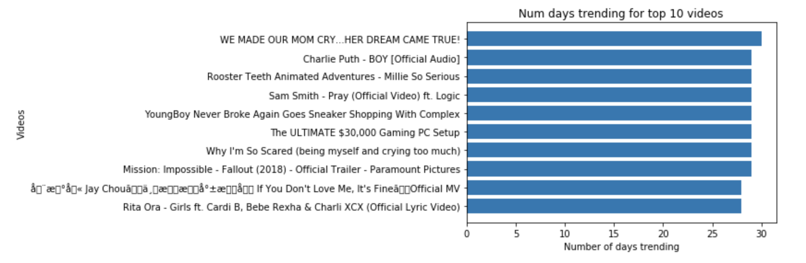

## Pandas-EDA-Case-Study

# Describe the data

## What features did you have to work with?
#### video_id (text)
#### trending_date (text)
#### title (text)
#### channel_title (text)
#### category_id (categorical)
#### publish_time (text)
#### tags (text)
#### views (numerical)
#### likes (numerical)
#### dislikes (numerical)
#### comment_count (numerical)
#### thumbnail_link (string)
#### comments_disabled (bool)
#### ratings_disabled (bool)
#### video_error_or_removed (bool)
#### description (text)

## Was data missing?

#### Description was missing 19478 values. Nothing was done for the missing values because description feature was not used

# Associations found:

This will become the README documenting your results.  

A description of the case study can be found [here.](case_study_description.md)
